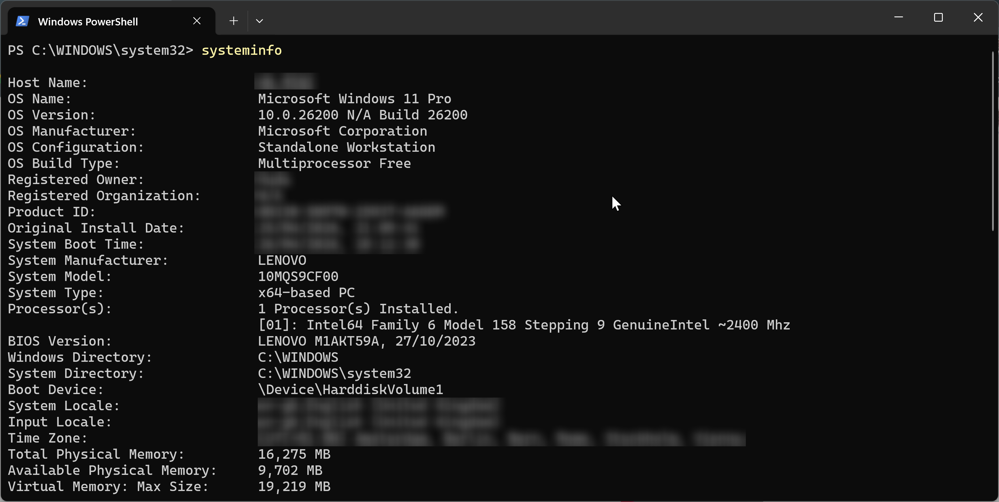
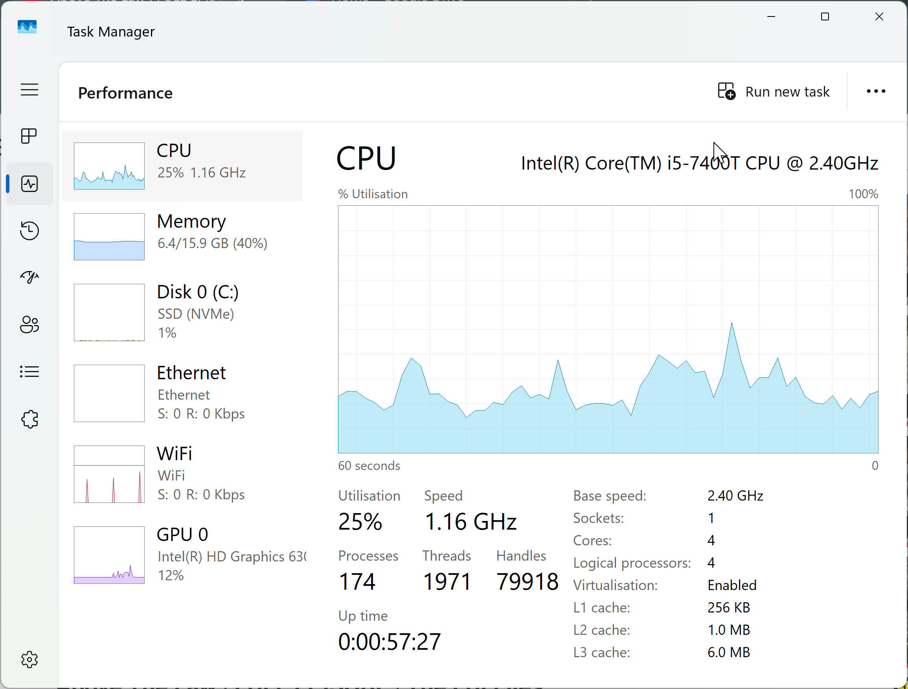

# 💻 Lenovo ThinkCentre M710q Tiny Validation

Specs:
* 16GB RAM
* 256GB SSD
* i5 7th Generation
* [Documentation](https://download.lenovo.com/pccbbs/thinkcentre_pdf/m710q_10yc_ug_en.pdf)

---

## 🧪 Initial Hardware Tests

### 1. Physical inspection, Power test, Boot process & Other tests

These are the observations for the different tests conducted:

| Test | Result | Observations |
|------|--------|--------------|
| Physical Inspection | Very good | Ports intact, no damage |
| Physical Inspection | Very good | Case: minor cosmetic wear |
| Power-on test | Excellent | Power LED active |
| Power-on test | Excellent | Fan smooth and quiet |
| Boot process | Pass | Boots into Windows |
| BIOS check | Pass | Hardware detected |
| Virtualization | Pass | Enabled in BIOS/UEFI settings |
| Network port | Pass | Link light active |

### 2. System Information

System checks where done using the **systeminfo** command in Powershell and using Task Manager with the details shown below:

---

## 🔍 Observations

- System boots reliably into OS
- No hardware faults detected during initial checks
- BIOS checked and hardware detected
- Virtualisation enabled
- Network interface is functional

---

## 📊 Result

Mini PC is operational and ready for lab use.