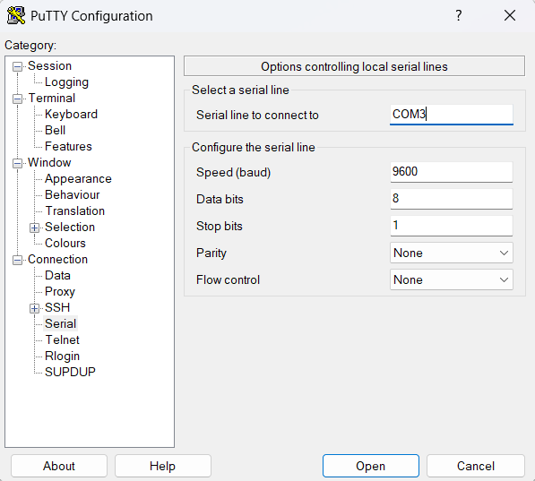
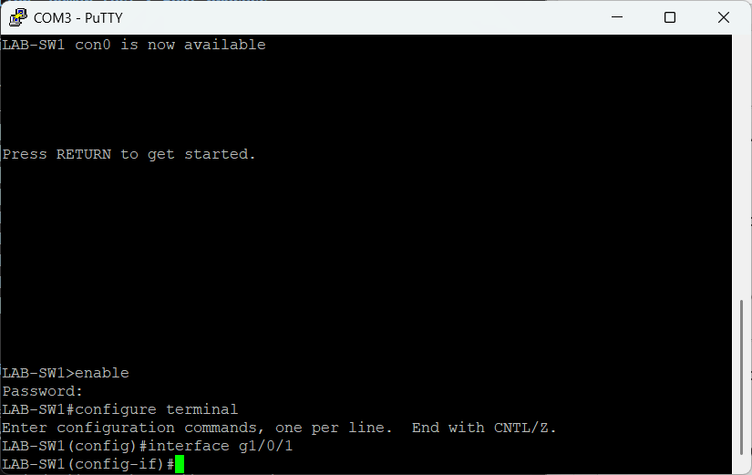
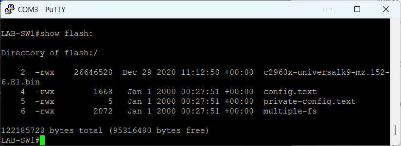
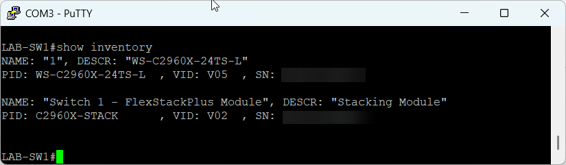
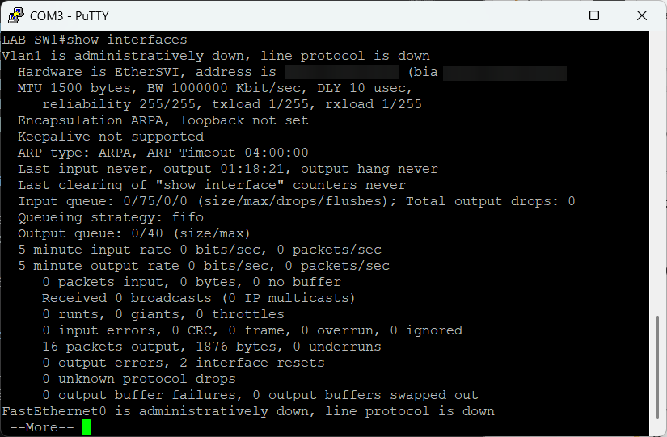
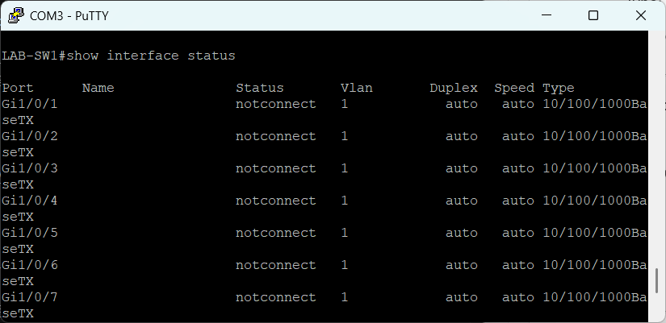
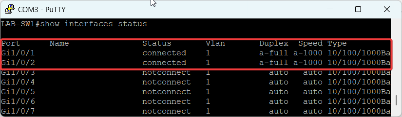
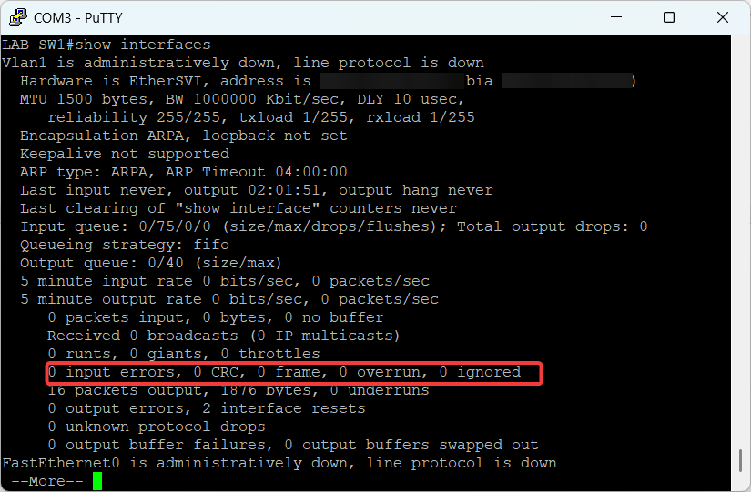

# 🔌 Cisco Catalyst 2960X-24TS-L Validation

Specs:
* Rack mountable
* 24 x Ethernet 10/100/1000 Gigabit ports
* Package Weight 9.19 kg
* [Documentation](https://www.cisco.com/c/en/us/td/docs/switches/lan/catalyst2960x/hardware/installation/guide/b_c2960x_hig.pdf)

---

## 🧪 Initial Hardware Tests

### 1. Physical inspection, Power test & Boot process

These are the observations for the different tests conducted:

| Test | Result | Observations |
|------|--------|--------------|
| Physical Inspection | Very good | Ports: no bent pins |
| Physical Inspection | Very good | Case: minor cosmetic wear |
| Physical Inspection | Very good | Power socket: firm |
| Physical Inspection | Very good | Fans: minimal dust |
| Power-on test | Excellent | LEDs flash, system LED green |
| Power-on test | Excellent | Fan smooth, no abnormal noise |
| Boot process | Excellent | Stable, no reboot loop |
| Port LED test | Excellent | All port LEDs active |
| Loopback test | TBA | Pending |

### 2. Console Connection

A USB → RJ45 console cable was used to in the PuTTY terminal which had the following settings:

### 3. System validation

System validation included navigating through the different Cisco IOS CLI modes and exploring commands to gather device information.

#### CLI modes

#### Hardware & Switch commands

**show flash:** - Stores Cisco IOS and displays Flash contents

**show inventory** - Displays Cisco unique identifier information

**show interfaces** - network interfaces status and stats

**show interface status** - important switch port characteristics

### 4. Port hardware tests

Tests done by plugging Ethernet cable into all the ports, Link lights are on and actively blinking.

### 5. Switching test

#### Loopback test

Test conducted by:
* plugging Port 1 → Port 2 
* running **show interfaces status**

**Results:**

The screenshot below shows both ports as connected confirming the switching fabric is working.

### 6. Error check

Using the **show interfaces** command, error check should be ideally 0 when looking for CRC and Input errors and the results show 0 errors.

---

## 🔍 Observations

- Device powers on consistently
- No unusual fan noise detected
- All visible ports appear functional
- Console access is working
- Switch is responding to basic commands
- No error tests identified

---

## 📊 Result

Switch is operational and ready for network configuration.