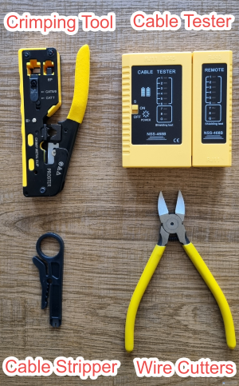
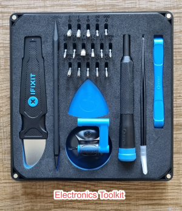
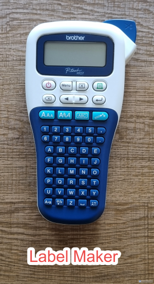
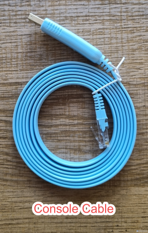

# 🧰 Tools Used

This section lists the tools used to build, configure, and maintain the lab environment.

---

## 🔧 Cabling Tools

| Tool | Purpose |
|------|--------|
| Punch-down tool | Terminating cables into patch panel |
| Crimping tool | Creating RJ45 cable ends |
| Wire stripper | Removing cable insulation |
| Cable tester | Verifying cable integrity |

  

---

## 🔧 Other Tools & Accessories

| Tool | Purpose |
|------|--------|
| Electronics Toolkit | For electronics devices and circuit assembling and repair  |
| Label Maker | Creating cable labels |

---

## 🖥️ Setup & Configuration Tools

| Tool | Purpose |
|------|--------|
| Console cable (USB to RJ45) | Accessing switch CLI |
| PuTTY | Terminal access to network devices |
| Windows OS | Initial system validation |
| BIOS utilities | Hardware configuration |

---

## 🧠 Documentation & Design

| Tool | Purpose |
|------|--------|
| GitHub | Portfolio and documentation |
| Draw.io (diagrams.net) | Network and rack diagrams |
| Markdown | Documentation format |