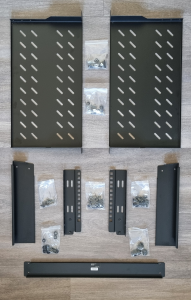
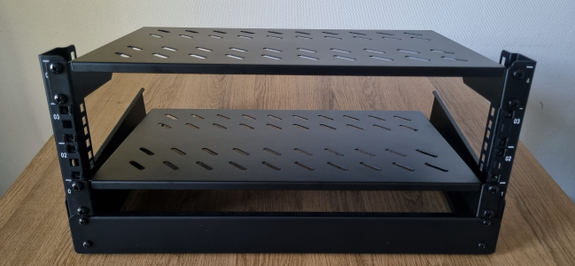
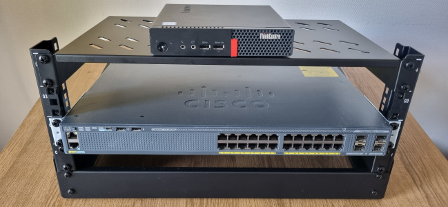

# 🔧 Physical Setup Process

This section documents how the hardware was physically installed and connected.

---

## 🧱 Assembly Steps

1. Installed rack and ensured stability
2. Mounted patch panel at the top position
3. Installed switch in middle position
4. Placed mini PC on lower shelf
5. Connected power cables to all devices
6. Routed network cables for clean layout

---

## 🔌 Cable Management

- Used short patch cables (25cm) for switch connections
- Routed cables to avoid tangling and obstruction
- Ensured clear separation between power and data cables

---

## 📸 Setup Images

### 1. Rack parts

### 2. Rack & shelves

### 3. Completed rack

### 4. Rack & devices

### 5. Final setup
(*added after completing the cabling section*)  

---

## 📊 Result

Physical setup is complete and ready for cabling and network configuration.