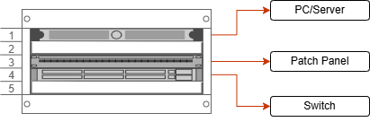

# 🗄️ Rack Layout

This is the design of the rack layout.

---

## 📐 Rack Configuration (4U - 2 Post)

| Rack Unit | Device |
|-----------|--------|
| U4 (Top) | Shelf – Lenovo Think Centre M710q Mini PC |
| U3 | Patch Panel |
| U2 | Cisco Catalyst 2960X Switch |
| U1 (Bottom) | Shelf – Switch support |

---

## 🧠 Design Considerations

- Heaviest device (switch) placed placed lower to reduce center of gravity  
- Bottom shelf provides additional support for the switch  
- Patch panel positioned above switch for clean cable routing  
- Mini PC placed at the top for easy access and separation from heavier equipment  
- Layout minimizes strain on rack structure  

---

## 🔌 Cable Flow Design

Data flows from end devices through structured cabling into the patch panel, and is then routed to the switch:

Devices (Mini PC, Laptop) 
            ↓ 
(cable) 
            ↓ 
[Patch Panel - BACK] 
            ↓ 
[Patch Panel - FRONT] 
            ↓ 
(short patch cable) 
            ↓ 
Switch

- Patch panel = **passive termination point**  
- Switch = **active network device** 