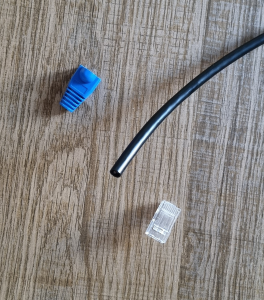
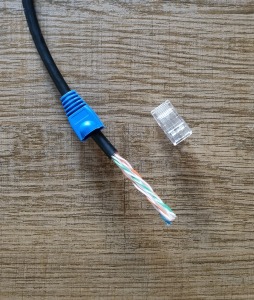
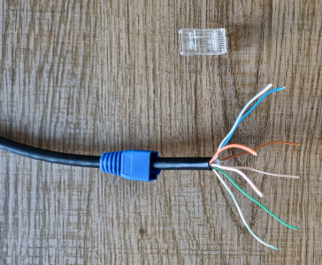
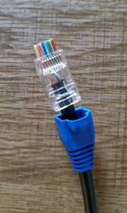
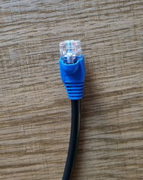
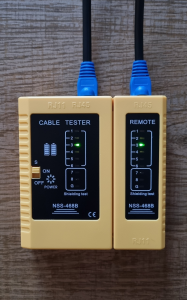
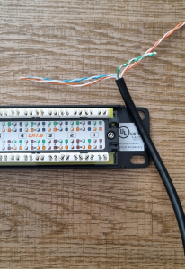
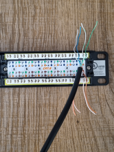
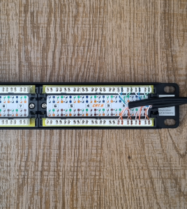

# 🔧 Cable Termination (T568B)

---

## 🧠 Standard Used

T568B wiring standard was used for all terminations.

White/Orange
Orange
White/Green
Blue
White/Blue
Green
White/Brown
Brown

---

## 🛠️ RJ45 Connector Installation (Crimping)

### Components and tools required

* RJ45 connectors
* RJ45 Strain relief boot
* Crimping tool
* Wire stripper
* Wire cutter

### RJ45 Process

1. Cut cable to required length
2. Install strain relief boot
3. Strip ~2–3 cm of outer jacket
4. Untwist pairs carefully
5. Arrange wires according to T568B
6. Flatten and align wires evenly
7. Insert wires into RJ45 connector
8. Ensure each wire reaches the end or goes through connector
9. Maintain correct order
10. Insert connector into crimping tool
11. Crimp firmly to secure connection and cut excess wire on connector

### Visual Steps

#### 1. RJ45 components

#### 2. Stain relief boot and stripping outer jacket

#### 3. Untwist pairs

#### 4. Insert wires and ensure wiring is correct

#### 5. Crimp connector

#### 6. Test the wiring is correct

### Key considerations

* Avoid untwisting pairs too early
* Ensure wires are fully seated
* Follow color coding exactly
* Ensure RJ45 Strain relief boot is inserted in the beginning

### Result

Cable successfully terminated and ready for use.

---

## 🛠️ Patch Panel Process Installation

### Patch Panel Process
1. Cut cable to required length
2. Strip ~5 cm of outer jacket
3. Maintain twisted pairs as close as possible
4. Arrange wires according to T568B
5. Insert wires into patch panel slots
6. Use punch-down tool to secure wires
7. Trim excess wire

### Visual Steps

#### 1. Patch panel and cable

#### 2. Wires inserted into patch panel slots (T568B)

#### 3. Final wiring

---

## ⚠️ Common Mistakes in Cable Termination

- Incorrect wire order (breaks connectivity)
- Wires not fully inserted into connector
- Excess untwisting of pairs (signal issues)
- Weak crimp causing intermittent connection
- Skipping cable testing