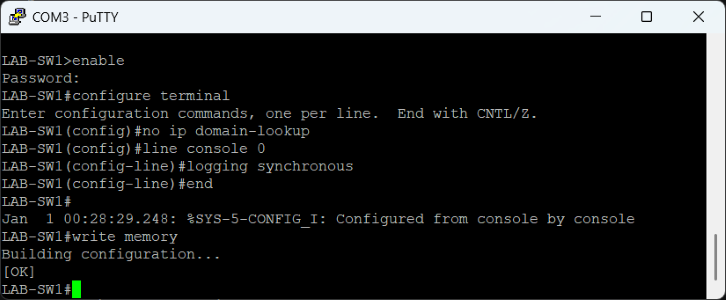
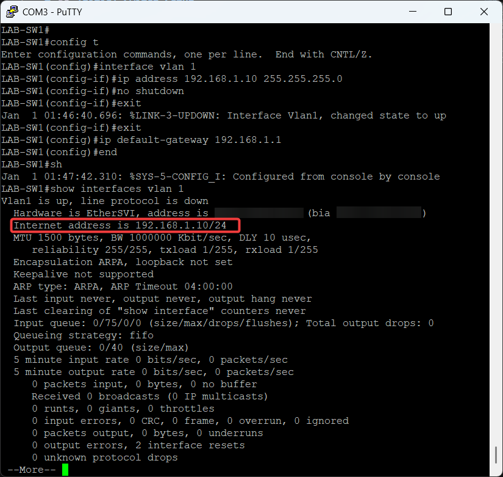

# ⚙️ Initial Switch Setup

---

## 🔌 Access Method

- Connected via console cable (USB to RJ45)
- Used PuTTY for terminal access

---

## 🧾 Basic Configuration

The basic commands for the initial configuration are shown below:

### Commands

* enable - Priviledged EXEC mode
* configure terminal - Global Configuration Mode
* no ip domain-lookup - Disables DNS lookup for mistyped commands
* line console 0 - Enters configuration for the console port
* logging synchronous - Prevents system messages from interupting while typing
* end - Moves back to Priviledged EXEC mode
* wrtie memory - Saves running-config to startup-config

---

## 🌐 Management IP Configuration

### 🎯 Objective

Assign an IP address to the switch for remote management.

---

### 🛠️ Configuration

These are the configuration steps for remote management.

Testing

---

## 📊 Result

Switch accessible and ready for further configuration.