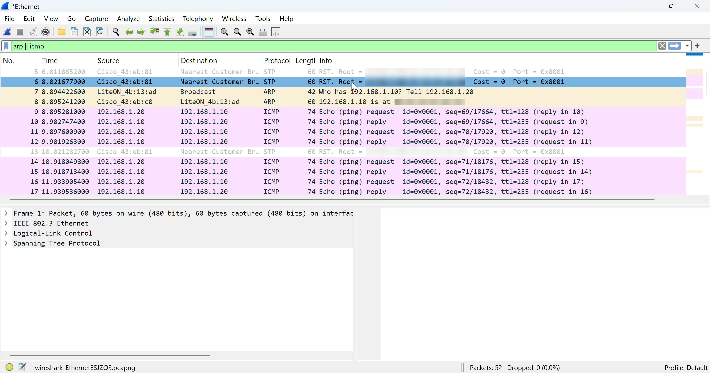
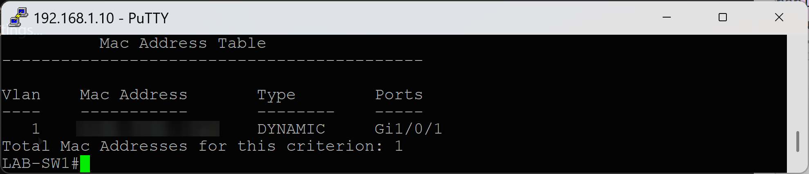

## 🌐 Connectivity Testing

### 🎯 Objective

Verify end-to-end connectivity between devices and VLAN segmentation.

---

### 🛠️ Tests Performed

| Test | Command | Expected Result |
|------|--------|----------------|
| Ping test | ping 192.168.20 | Successful replies |
| Packet Tracing (Wireshark) | ping 192.168.20  | Reachable |

---

### Wireshark Analysis

#### 🎯 Objective

Capture and analyze network traffic at the packet level.

---

#### 🛠️ Steps

1. Install Wireshark on Mini PC  
2. Select active Ethernet interface  
3. Start capture  
4. Run ping command  
5. Stop capture  

---

#### 🔍 Filters Used

icmp
arp

---

### MAC Address Table Verification

Command: **show mac address-table dynamic**

---

### Observations

* ICMP echo request and reply packets captured
* ARP resolution process observed
* Source and destination MAC addresses verified
* MAC addresses dynamically learned
* Ports mapped correclty

---

### 📊 Result

Network traffic successfully captured and analyzed.