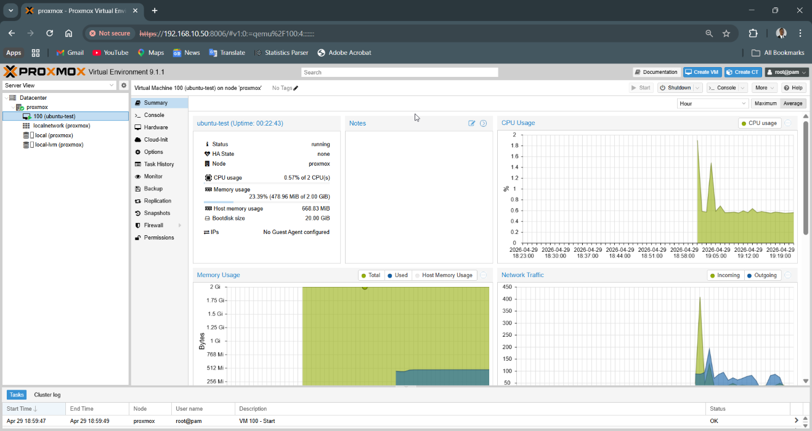

# Proxmox Installation Guide

## 📌 Overview
This document outlines the installation of Proxmox Virtual Environment (VE) on a dedicated machine.

---

## 🧰 Requirements

- Physical machine (mini PC)
- USB boot media
- Proxmox VE ISO
- Network connection to switch

---

## 🔽 Step 1: Download ISO

Download from:
https://www.proxmox.com/en/downloads

---

## 💾 Step 2: Create Bootable USB

Use tools like:
- Rufus (Windows)

---

## 🖥️ Step 3: Install Proxmox

1. Boot from USB
2. Select **Install Proxmox VE**
3. Accept license agreement
4. Select target disk
5. Configure:

- Country / Timezone
- Keyboard layout

---

## 🌐 Step 4: Network Configuration

Example:

- IP Address: 192.168.10.50
- Gateway: 192.168.10.1
- DNS: 8.8.8.8

---

## 🔐 Step 5: Set Credentials

- Root password
- Email address

---

## 🔁 Step 6: Complete Installation

- Wait for install to finish
- Reboot system

---

## 🌍 Step 7: Access Web Interface

From laptop browser: https://192.168.10.50:8006

---

## ⚠️ Notes

- Self-signed SSL warning is expected
- No subscription warning is normal

---

## ✅ Validation

- Web UI accessible
- Node visible
- Storage available

---

## 🎯 Outcome

Proxmox host successfully deployed and ready for VM creation.