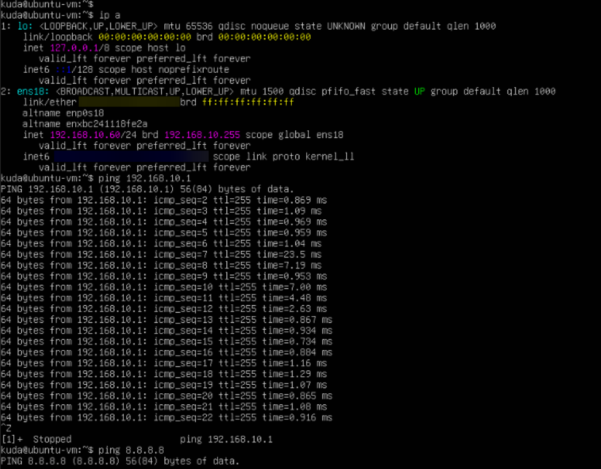
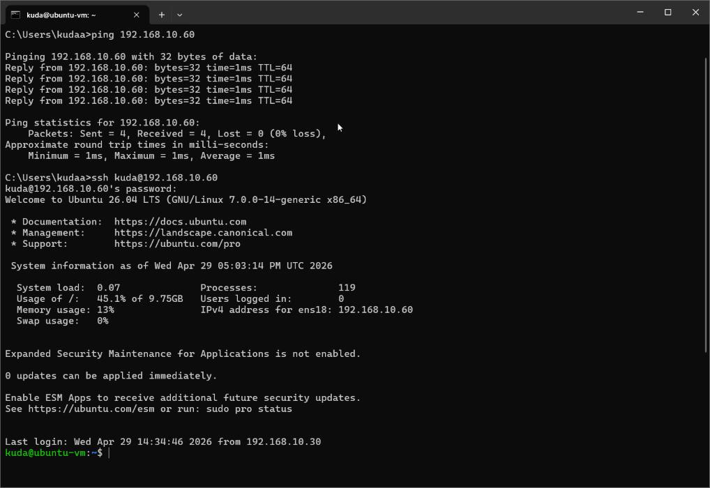
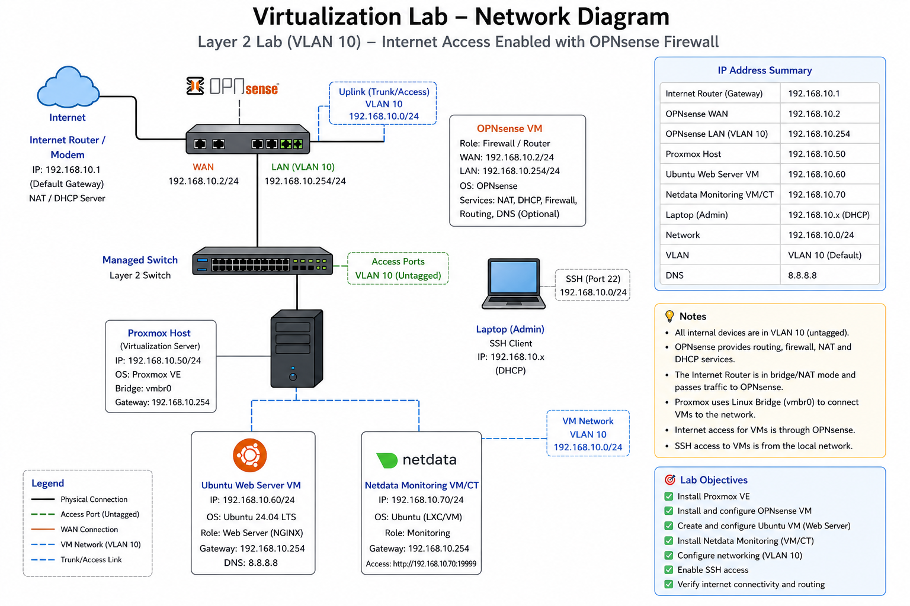

# Virtual Machine Setup (Ubuntu Server)

## 📌 Overview
This document describes the creation and configuration of an Ubuntu Server virtual machine in Proxmox.

---

## 🖥️ VM Configuration

- VM ID: 100
- Name: ubuntu-test
- OS: Ubuntu Server 24.04 LTS
- Disk: 20GB
- RAM: 2GB
- CPU: 2 cores

---

## 📀 Step 1: Upload ISO

1. Go to Proxmox UI
2. Select Storage → local
3. Upload Ubuntu Server ISO

---

## ⚙️ Step 2: Create VM

- Click **Create VM**
- Select ISO image
- Assign CPU, RAM, Disk
- Network: Default bridge (vmbr0)

---

## ▶️ Step 3: Start VM

- Open console
- Begin installation

---

## 🧱 Step 4: Ubuntu Installation

### Key choices:

- Installation type: Ubuntu Server
- Storage: Use entire disk (LVM)
- User: ******
- Password: ******

---

## 🌐 Step 5: Network Configuration

Static IP assigned:

- IP Address: 192.168.10.60
- Subnet: 255.255.255.0
- Gateway: 192.168.10.1
- DNS: 8.8.8.8

---

## 🔐 Step 6: Enable SSH

✔ Install OpenSSH server  
✔ Allow password authentication  

---

## 🔁 Step 7: Reboot

- Remove ISO
- Restart VM

---

## 🔍 Step 8: Verify Networking

Verification using commands to get IP address and ping switch (192.168.10.1)

---

## ✅ Results

* VM reachable over network
* SSH login successful
* Stable internal connectivity

---

## ⚠️ Known Limitation

* No internet access (no router in lab)
* Local network only

---

## 🎯 Outcome

Fully functional Linux server deployed inside Proxmox and accessible remotely.

