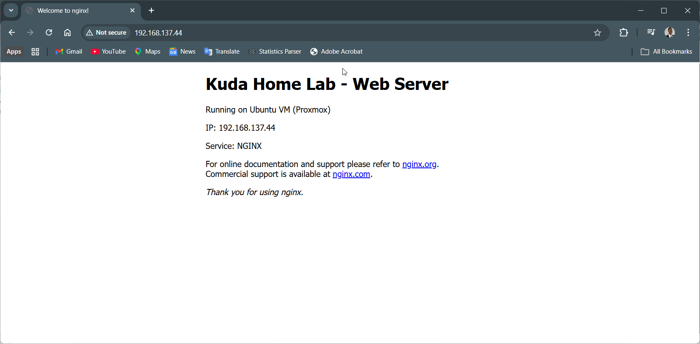
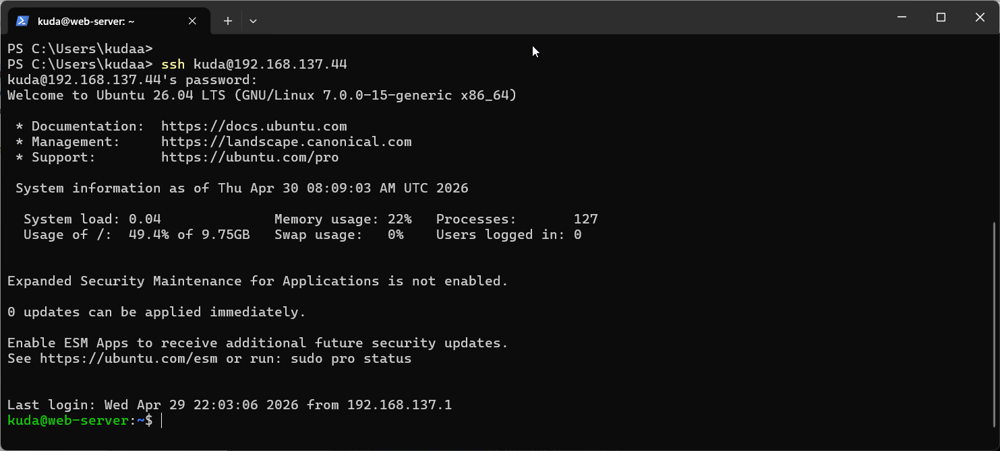
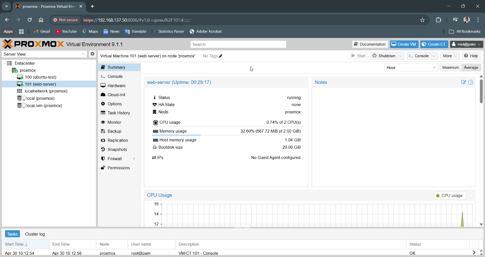

## 🌐 Web Server Deployment (NGINX)

- VM: Ubuntu 26.04 LTS
- Hypervisor: Proxmox VE
- Network: vmbr0 (DHCP)
- IP Address: 192.168.137.44
- Access: SSH enabled

---

### Steps:
1. Installed Ubuntu Server VM
2. Configured networking (DHCP)
3. Enabled SSH access
4. Installed NGINX
5. Verified service via browser

---

### Verification

#### NGINX browser ####

#### SSH ####

#### Proxmox VM ####

---

### Result:

Successfully deployed and accessed web server over local network.