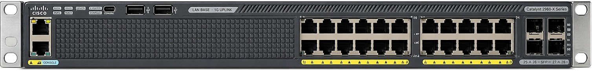
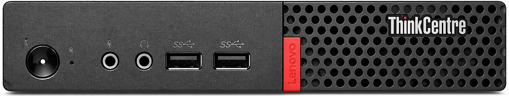

# 🖧 Home Lab Data Center Portfolio

## 📌 Overview

This project documents my hands-on home lab where I am building and operating a small-scale data center environment using enterprise-grade hardware.

## 🎯 Objectives

* Learn Cisco switching (VLANs, ports, configuration)
* Build structured cabling setup
* Set up a rack for the equipment
* Validate and test network hardware
* Run virtualization workloads
* Practice troubleshooting

---

## 🧰 Lab Equipment

### Network

**Cisco Catalyst 2960X-24TS-L**

* [Documentation](https://www.cisco.com/c/en/us/td/docs/switches/lan/catalyst2960x/hardware/installation/guide/b_c2960x_hig.pdf)

---

### Compute

**Lenovo ThinkCentre M710q Tiny**

Specs:
* 16GB RAM
* 256GB SSD
* i5 7th Generation
* [Documentation](https://download.lenovo.com/pccbbs/thinkcentre_pdf/m710q_10yc_ug_en.pdf)
    
---

### Infrastructure

* 4U 2-post rack with shelves
* Patch panel
* 25cm Cat6 cables

---

## 🧪 Hardware Validation

**Cisco Catalyst 2960X-24TS-L initial hardware tests.**

| Test | Result | Observations |
|------|--------|--------------|
| Physical Inspection | Very good | Ports → Excellent → no bent pins |
| Physical Inspection | Very good | Case → Good → minor scratches and dents (no impact) |
| Physical Inspection | Very good | Power socket → Excellent → firm and straight |
| Physical Inspection | Very good | Fans → Very good → not blocked, minimal dust |
| Power-on test | Excellent | LEDs flash, system LED green |
| Power-on test | Excellent | Fan smooth, no grinding or clicking |
| Boot Process | Excellent | LEDs stable, quiet, no reboot loop |
| Console access | TBA | TBA |
| Port LED test | Excellent | All port LEDs active |
| Loopback test | TBA | TBA |

➡️ Result: Switch testing is still in progress

---

**Lenovo ThinkCentre M710q Tiny initial hardware tests.**

| Test | Result | Observations |
|------|--------|--------------|
| Physical Inspection | Very good | Ports (USB, Ethernet) → Excellent → no physical damage |
| Physical Inspection | Very good | Case → Very good → minor scratches and dents on front face |
| Physical Inspection | Very good | Power socket → Excellent → firm and straight |
| Physical Inspection | Very good | Wifi antenna → Missing → not required for this home lab |
| Power-on test | Excellent | Power indicator green, Storage indicator green, Illuminated red dot on |
| Power-on test | Excellent | Fan smooth, no grinding or clicking |
| Boot Process | TBA | TBA |
| BIOS Check | TBA | TBA |

➡️ Result: PC testing is still in progress

---

## 🚀 Status

🟢 Hardware setup in progress
🟡 Network configuration pending
🔵 Virtualization setup pending
