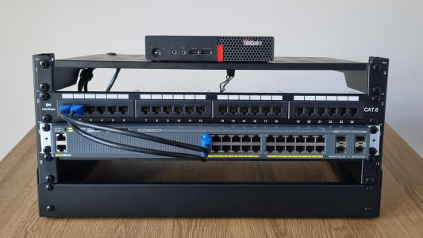

# 🖥️ Home Lab Data Center Portfolio

## 📌 Overview

This project demonstrates the design, build, and operation of a **home lab environment that simulates a real-world data center**.

The lab focuses on:

* Networking fundamentals (VLANs, switching)
* Infrastructure design (rack layout, cabling)
* Virtualization (Proxmox)
* Linux server deployment
* Troubleshooting and operational practices
* Safety and compliance awareness

---

## 🧱 Architecture Overview

Laptop → Switch → Proxmox Host → Virtual Machines

* Network: `192.168.10.0/24`
* Proxmox: `192.168.10.50`
* Ubuntu VM: `192.168.10.60`

---

## 📂 Project Structure

### 🔌 01 - Hardware

* Equipment setup and validation
* Rack installation and layout

### 🧰 02 - Tools

* Tooling used for setup (crimping, testing, etc.)

### 🧱 03 - Setup

* Physical rack assembly
* Cable flow design

### 🔌 04 - Cabling

* Patch panel wiring (T568B)
* RJ45 termination
* Cable management

### 🌐 05 - Networking

* Switch configuration
* VLAN setup
* Connectivity testing

### 🖥️ 06 - Virtualization

* Proxmox installation
* VM creation and configuration
* SSH access

### 🔧 07 - Troubleshooting

* Real-world issue scenarios
* Layered troubleshooting approach
* Evidence-based debugging

### 🛡️ 08 - Safety & Compliance

* Data center safety practices
* Environmental considerations
* Secure handling of systems and data

---

## 🎯 Key Achievements

* Built a structured home lab rack environment
* Configured VLAN-based networking
* Deployed Proxmox virtualization platform
* Created and configured Linux virtual machines
* Established SSH-based remote access
* Documented real troubleshooting scenarios

---

## 🧠 Skills Demonstrated

* Networking (Layer 1–3)
* Linux system administration
* Virtualization (Proxmox)
* Infrastructure design
* Troubleshooting methodology
* Documentation and operational discipline

---

## 🚀 Why This Matters

Modern infrastructure environments rely heavily on:

* Virtualization platforms like Proxmox
* Network segmentation (VLANs)
* Automation and troubleshooting

Even small labs can replicate these principles and provide **hands-on experience equivalent to real data center environments** ([Virtualization Howto][1])

---

## ⚙️ Final Setup

---

## 📡 Network Diagram

---

## 🚀 Next Steps

* Implement VLAN segmentation (VLAN 10 / VLAN 20)
* Add Docker / container workloads
* Introduce monitoring and logging
* Simulate multi-VM environments

---

## 👤 Author

**Kuda Nyikadzino**

---

[1]: https://www.virtualizationhowto.com/2026/01/the-smallest-home-lab-that-still-feels-like-a-real-datacenter/?utm_source=chatgpt.com "The Smallest Home Lab That Still Feels Like a Real ..."
